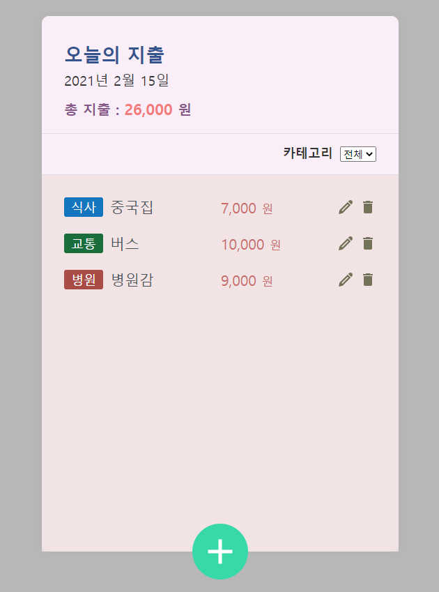

### 프로젝트 요약

 * 리액트로 구현한 가계부
 * 기능
    1. 추가
    2. 삭제
    3. 수정
    4. 카테고리별 보기
    5. 사용 금액 총합

#### 컴포넌트

 * 전체 레이아웃
 * 헤드부분 (날짜, 지출)
 * 카테고리
 * 전체 List (ItemList)
 * 각 Item
 * 버튼, 다이얼로그 등 공통적으로 사용될 것들
 * 인풋, 추가를 위한 id 값 등 전역관리

#### 추가 기능
 * contextAPI 를 이용해 등록 버튼 클릭 시 디스패치, 이후 기존의 값에 추가

#### 수정 기능
 * 수정 버튼 클릭시 다이얼로그 오픈
 * input 에 defaltValue 를 이용해 List 컴포넌트에서 받아온 값들을 넣어줌
 * 취소 시 처음 받아왔던 값으로 다시 교체
 * 수정 시 변한 값을 디스패치, 디스패치 시 아이디가 같은 값을 찾아 값 변경

#### 삭제 기능

 * 디스패치 시 id 값을 넣어 filter 를 이용해 같은 값 제거

